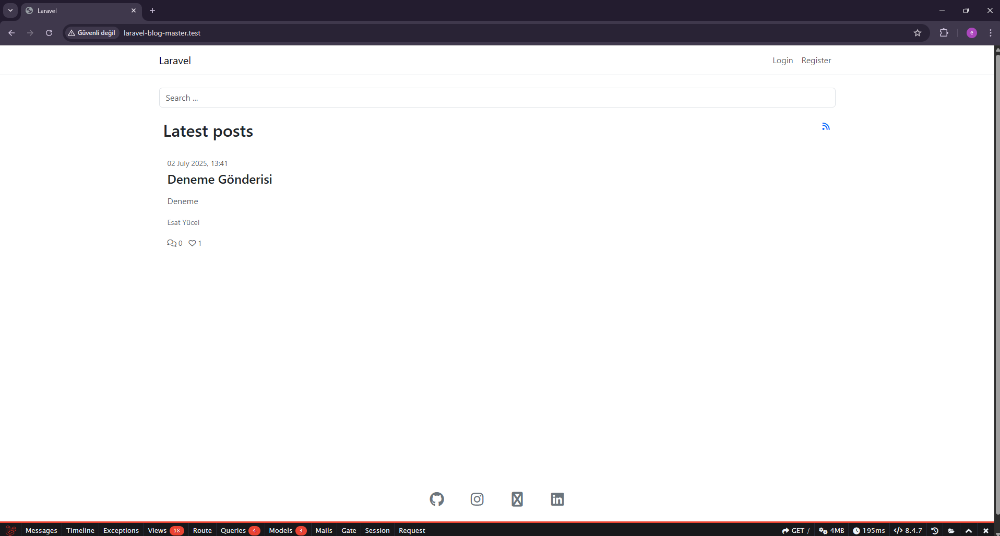
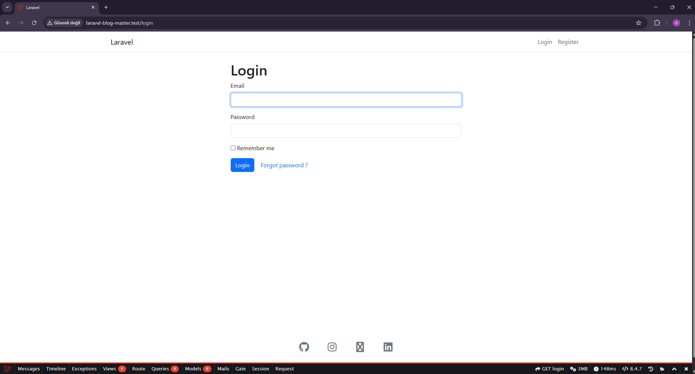
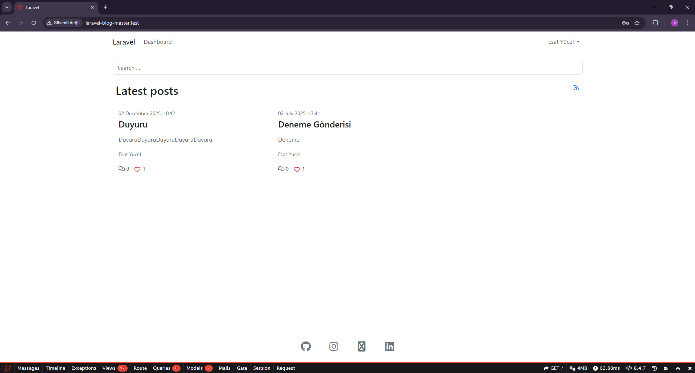
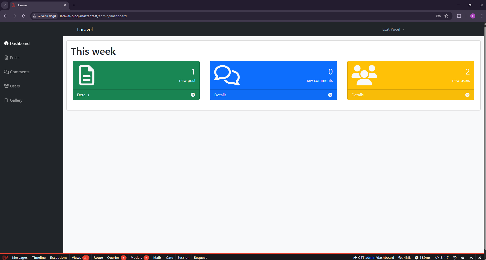
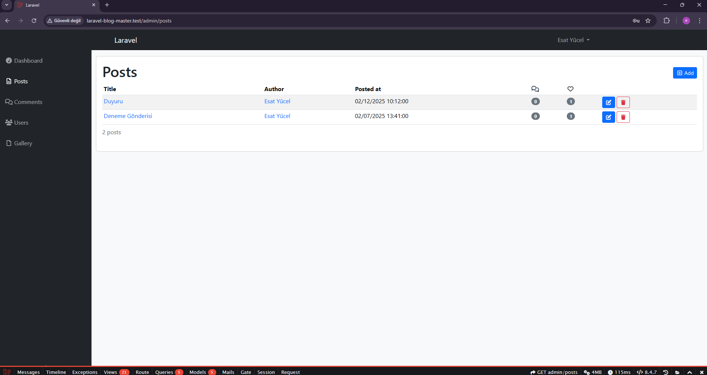
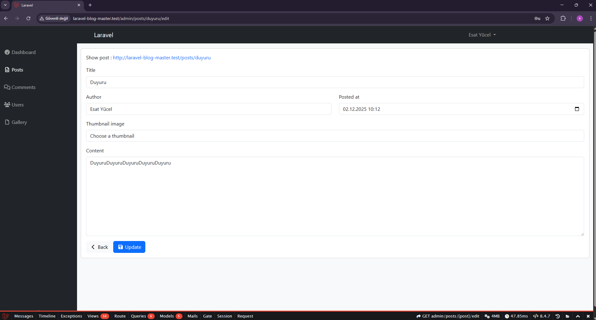

# 📰 Laravel Blog Projesi

Laravel tabanlı geliştirilmiş bir blog yönetim sistemidir. Basit ve kullanışlı bir arayüz ile yazı, kategori ve kullanıcı yönetimini sağlamaktadır.

---

## 📸 Ekran Görüntüleri



---




---



---




---




---



---

## ⚙️ Kurulum Adımları

```bash
git clone https://github.com/kullaniciadi/laravel-blog-master.git
cd laravel-blog-master

composer install
npm install && npm run dev

cp .env.example .env
php artisan key:generate

php artisan migrate --seed
php artisan serve
